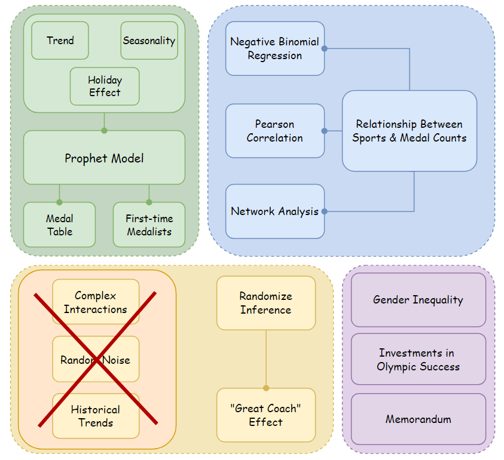
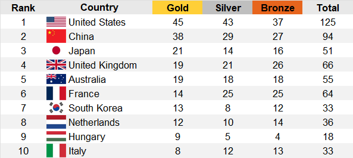

# MCM 2025 - Mathematical Contest in Modeling 2025
__Problem C:__ Models for Olympic Medal Tables

## Overview

This study focuses on using the __Prophet__ model to predict the medal table for the __2028 Los Angeles Olympics__, along with the corresponding prediction intervals. We then apply __KMeans__ clustering to identify countries that show significant changes in their medal counts. Additionally, we use __Negative Binomial Regression__ to examine the relationship between the number of events a country participates in and the number of medals they win, and assess this relationship using __Pearson Correlation__ coefficients. We also apply __Network Analysis__ to identify key sports for prominent countries in various Olympic Games. The study includes visualizations to uncover insights such as the impact of the host country, gender equality, and Japan's investment in the Olympics. We also utilize __Randomized Inference__ to test and estimate the contribution of the "great coach" effect on medal counts. Finally, we compiled our findings into a memorandum to send to the International Olympic Committee (IOC), highlighting the key insights from our research.



## Repository Structure
```
MCM2025/
├── code/
│ ├── insight
│ ├── model
├── data/
├── figures/
├── docs/
├── literature/
├── results/
├── 2025_MCM_Problem_C.pdf # Problem description 
├── 2526908.pdf # Our paper for the problem
└── README.md
```

## Projection for the medal table


